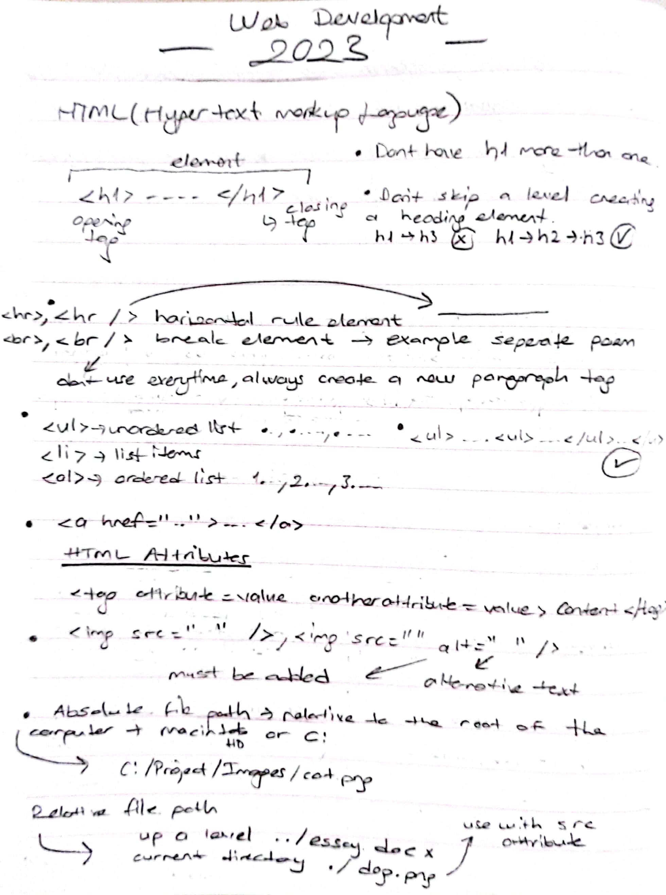
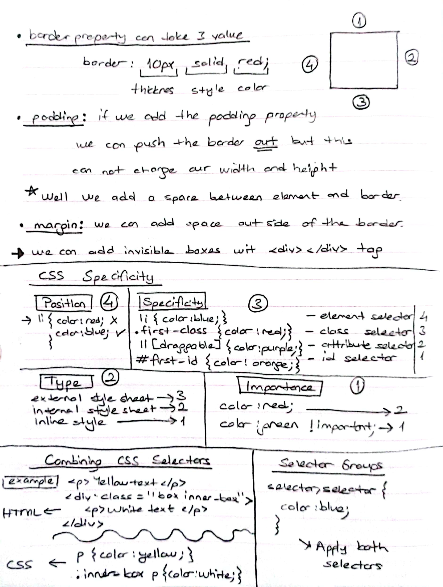
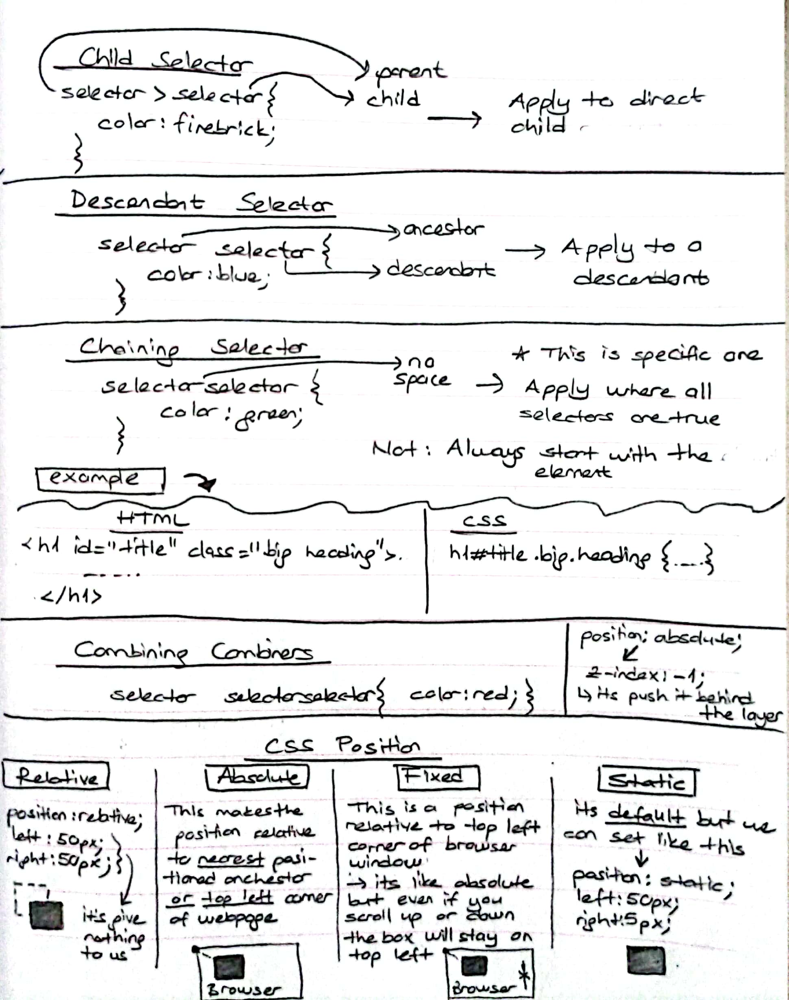
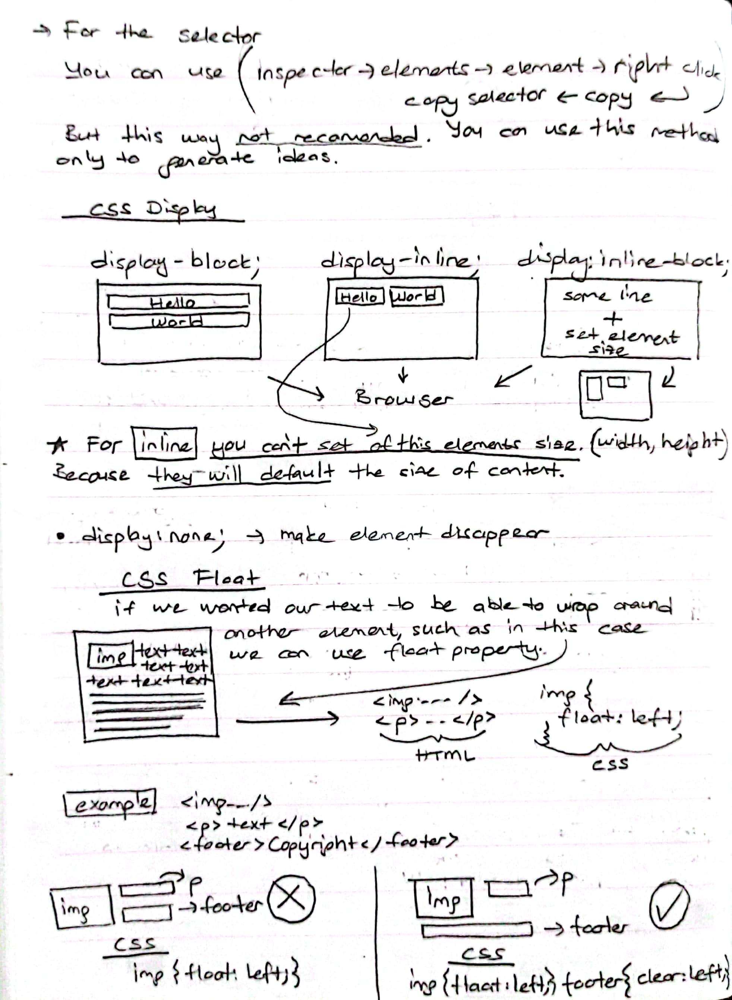
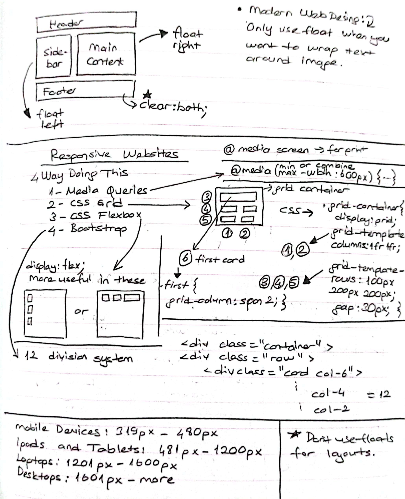
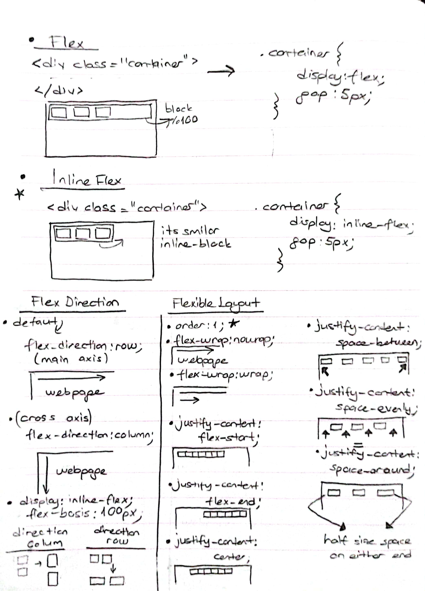
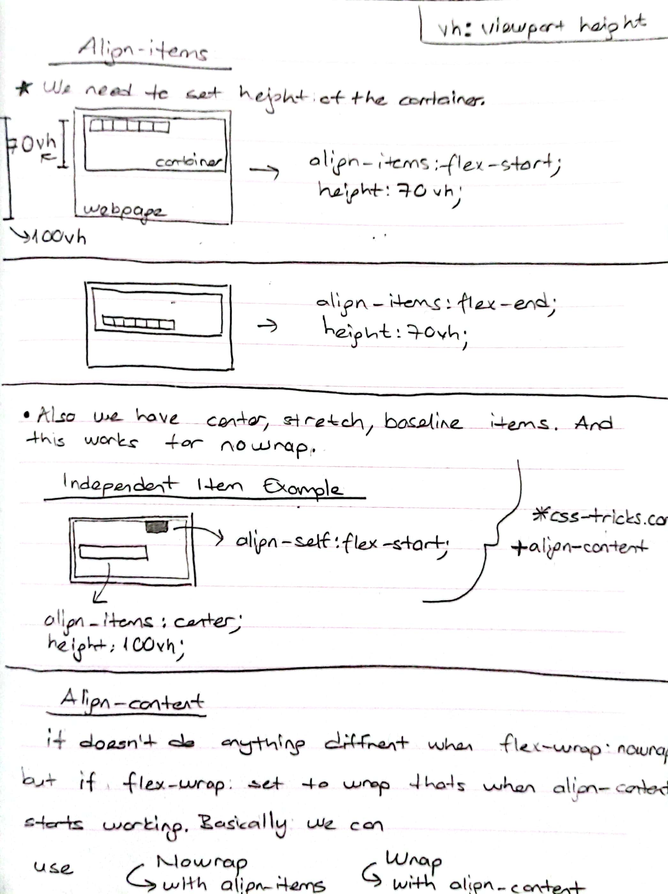

# WebDevStudies
<h2>Hello!</h2>

    
This repository contains

    <ul>
        <li>What I learned from Dr. Angela Yu's <a href="https://www.udemy.com/course/the-complete-web-development-bootcamp">The Complete 2023 Web Development Bootcamp</a></li>
        <li>My own work</li>
        <li>Bootcamp notes for specific personal reminders
            <ol >
                
                
                 
                
                
                
                
                
                
            </ol>
        </li>
    </ul>

